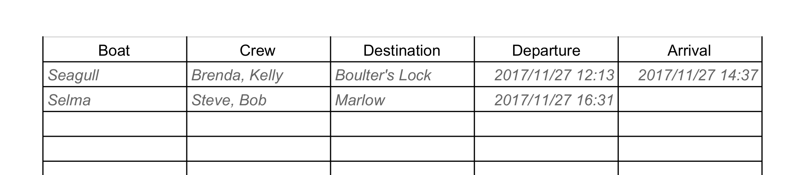
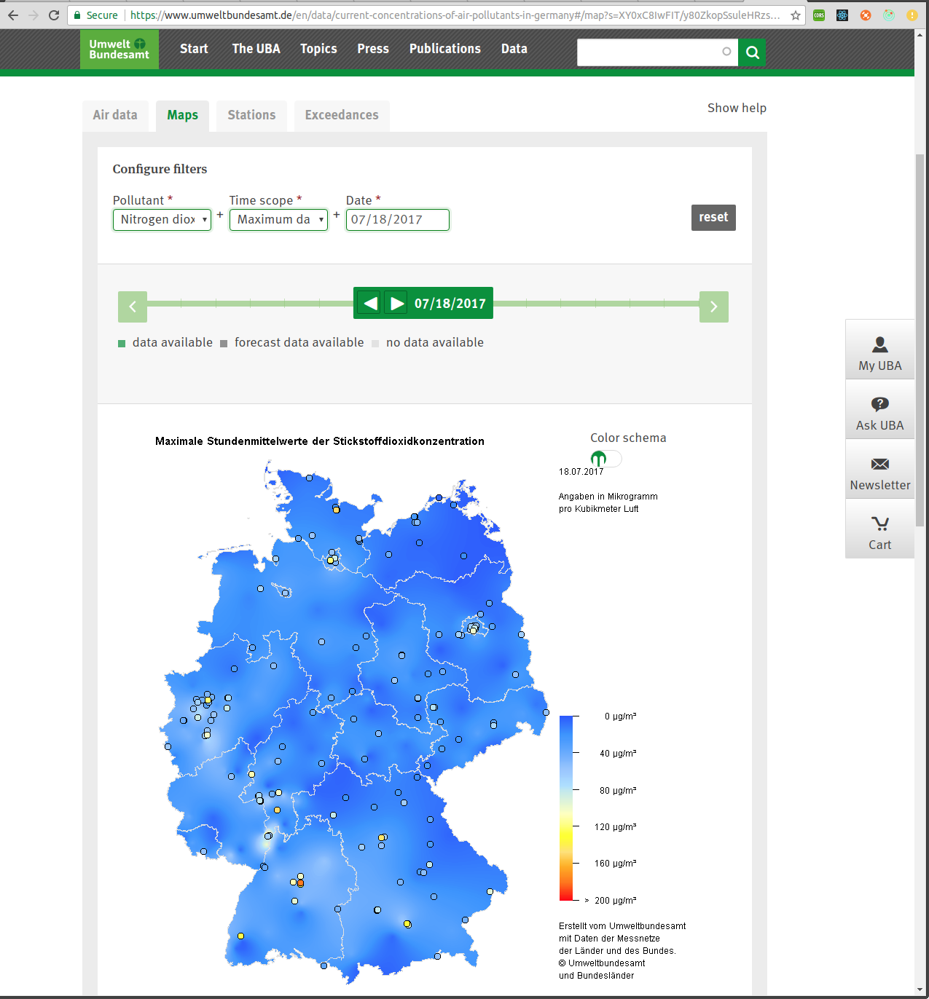

# MI131 Class Project

A successfull project is required to be granted the ECTS credits for MI131.

## General

Each project should cover an entire server/client stack. 
- the entire stack must be implemented in Javascript (≥ ES6)
- package management must be done using `npm` 

All Projects are to be done in groups of 4. Each group has to hold a short (15 minutes) final project presentation at
the end of the term. This presentation should consist of:

1. Checking out the project afresh and building.
2. Running the test suite for both server and client.
3. Presenting the software in use.
4. Discussing a little bit of code and talking about design choices and some issues that came up during developement.

General requirements for the project setup:
- code must be placed in a public Github repo
- evolution of the project must be visible through small commits
- both client and server must provide `Mocha`/`Chai` testing
- all tests must automatically run on TravisCI on each commit
- checked out and built on a new machine the project must be runnable and deployable
    1. web apps can be bundled
    2. server runs and provides API and web apps
    3. `Cordova` apps must run on emulator 
    
What you can expect to find on a checkout:
- `npm` (≥ 3,5)
- `NodeJS` (≥ 6.11)
- `MongoDB` (≥ 3.4)
- `Cordova` (≥ 7.1)
- `Android SDK` (8.0)
- Android Virtual Device (Nexus 5X SDK 26)

#### Grading System

Some remarks on what is going to determine grades (in order of importance):
- functioning software
- explaining design choices (code and usage)
- usability of the software
- code quality (readable and comprehensible) 
- test coverage
- small and well explained git commits (single line commit message)
- feature completeness

It is more important to provide running software than a completed project. Better provide a well done feature subset, 
than a badly done completed project.

#### Client

The client should be implemented using (exceptions may be granted):
   
-  `Webpack`
-  `React`
-  `Redux`
-  `socket.io`

The client data model has to be placed in a `Redux` store and should be well designed an normalized to ensure smooth
exchange with the backend REST API data model. Actions and reducers should be defined to reflect all the users actions 
and make the user interface debuggable through message logging. Careful and robust handling of async events is expected.

Mobile apps have to be bundled using `Cordova`.

#### Server

The server should be implemented using:
    
- `MongoDB`
- `Mongoose`
- `Express` or `Koa`

The API has to follow REST principles and may use websockets for push updates to clients. Transactions should be kept
as atomic as possible through the use of `MongoDB` queries. Use `Mongoose` schemas to ensure typing in the database.

LEGAL NOTICE: We will be using third party APIs and libraries. All of these a subject of copyright and terms of use. 
              We will be using these APIs for non commercial and educational purposes only.

## Project Choices

### Water Sports Logbook

`Multi Client Architecture`, `Client Data Model`

`Database Model`, `Web App`, `Mobile App`

`3rd Party Maps API`

Rowing and sailing are popular sports in germany. Insurances require rowers/sailors to sign in to a logbook, when 
hitting the water and sign out on return.

Such a logbook page looks something like this:

This paper bound method works perfectly fine for most clubs. Its shortcomings are that extracting data like

- which boats has been used how much
- how often do club members show up in average
- which distance does a member do in average per week

has to be done in a manual and tedious manner. 

A digital version could improve this. To gain acceptance a digital logbook has to be as easy to use and little 
time consuming as its paper bound predecessor.

**Your task:**

Write a web app version of the logbook for public use in the boat house. Add a protected admin interface to manage users
and boats within this app.

Write a smart phone mobile app that is bound to a specific member and allows her to

- create a new trip
- sign in to existing trip
- start a trip
- end a trip

in a fast and simple way. Make sure all apps instances are kept in sync.

Extra: Chosing the destination on a map would be a plus!

### Pullution Atlas

`Visualization`, `Mock Data Generation`, `User Encouragement` 
`Web App`, `Mobile App`, `3rd Party Maps API`,
`Mobile Phone Location API`

Every larger city in the world suffers pollution levels so high they pose a threat to public health.
Of all German cities Kiel is among those with a high yearly average of pollution:

The central german pollution database can be found at:

[Figures by the Umwetbundesamt](https://www.umweltbundesamt.de/en/data/current-concentrations-of-air-pollutants-in-germany#/start?s=q64FAA==&_k=8qajg0)

If you look at the map of ground based stations you can see how sparse the data collection network actually is.
If you take a close look at the German economy: 
- [nearly 750.000 employed in car industry](https://en.wikipedia.org/wiki/Automotive_industry_in_Germany),
- [high percentage of industry remaining compared to other western countrys](https://en.wikipedia.org/wiki/Economy_of_Germany) 
- [8.4% of worlds exports and 6.5% of worlds imports](http://stat.wto.org/CountryProfile/WSDBCountryPFView.aspx?Language=F&Country=DE)

pollution alerts that raise discussion about the influence of traffic, industry and transport on air quality is not too
popular among German political and industrial leaders.

Thus we should be careful about German government data on air quality. It would be nice to have a crowd sourced set of
pollution data, just to have a neutral data source.

For this project will assume there were a small cheap 
[pollution measurement device](https://www.aeroqual.com/outdoor-air-quality/outdoor-portable-air-monitors), 
available that connects to the users smart phone via Bluetooth and transmits  

- PM10
- sulphur dioxide
- ozone
- carbon monoxide
- nitrogen dioxide

levels.

**Your task:**

Write a smartphone app for use by the user, that gets the users location and generates a slightly randomized set of 
pollution levels. Don't make the pollution data totally random. Make sure the data takes time and location into account
so the statistical total output will be a time dependent pollution map. Visualize the measurements transmitted by that 
user and encourage him to

- transmit data regularly from spots that lack measurements
- transmit from these spots several times a day

Create a visualization of the pollution map collected by all users and make display it in the
mobile app and create another web app to display this data on desktop computers.
  
Extra: Although the actual pollution data will be generated, presenting data actually sent from mobile devices to the 
server will be a plus! 

### Mobile Reception Atlas

`Visualization`, `User Encouragement`

`Web App`, `Mobile App`, `3rd Party Maps API`, `Mobile Phone Location API`
 
`Mobile Phone Reception API`

Although Germany is rather densely populated by European standards one will often experience bad mobile reception 
outside urban areas. A good example of this is a train journey from Kiel to Hamburg.

Mobile companies provide their own public data on mobile reception:

[T Mobile](https://www.telekom.de/start/netzausbau)

[Vodafone](https://www.vodafone.de/hilfe/netzabdeckung.html)

[O2](https://www.o2online.de/service/netz-verfuegbarkeit/netzabdeckung/)

Just as with the air pollution data, we should be sceptical about this data, since this data is an important factor in
mobile companies advertising their service.

**Your task:**

Create a mobile phone app, that reads the phones reception levels and position and sends them to a database. Make sure
you collect data for each mobile network separately. Visualize the measurements transmitted by that user and encourage 
her to send as much data from different locations as possible.

Create a visualization of the reception map collected by all users for all mobile providers and make display it in the
mobile app and create another web app to display this data on desktop computers.
  
Extra: Presenting some real data during presentation will be a plus!

### Party Radar

`Matching/Prediction`,`Binary Data Handling`

`Mobile App`,

`3rd Party Maps API`, `Mobile Phone Location/Photo API`, `3rd Party Data API` 

Due to the large number of students Kiel has quite a number of clubs and bars compared to other small German cities.

Nearly all information about whats going on is available publicly through facebook and 
[https://www.wasgehtinkiel.de/](https://www.wasgehtinkiel.de/). All of this information is tabular and requires reading
descriptions. Boring!

So imagine you get out your phone, open your party radar app and on a map see all the stuff going on round you right now
including live pictures and a prediction of how much you'll enjoy going to each location.

**Your Task:**

This project will require machine learning experience. Do not attempt to take this project if you lack this 
experience!

In the server:

1. wrap location/event API or create own location event database
2. create photo storage with short memory (5 minutes)
3. implement an incremental prediction/matching algorithm that learns, by constantly evaluating prediction against user votes

Write a mobile app, that will

1. display a map of your surroundings with all events currently going on.
2. determines if you are currently inside a location and lets you 
    - vote if you do or don't like it
    - take instant pictures, that will only be available for 5 minutes from inside your location
4. let's you view the instant pictures other users took of other locations
5. Uses a prediction algotithm based on location, event and other people, whether you'll enjoy an event

Extra: Use nah.sh HAFAS (see next project) to show you public transport from your current location to an event.

### Lecture Planner
  
`Complex Data`, `Crawling`

`Mobile App` 

`3rd Party Maps API`, `Mobile Phone Location API`, `3rd Party Data API` 

Kiel has 3 universities 34,000 students. Kiels public transport service 
[KVG neither provides their own route planning sytem nor a mobile app](http://kvg-kiel.de/en/timetable/route-planner/)

Since most of the getting around for students involves getting to university and back, why not offer a solution 
specific to this problem? We are looking for a solution to the following question:

"If I want to attend the next event of `class A` and I will start at `location B`, present me with the `n` best ways to
get there on time via public transport."

The real challenge here is to get at and process the required data!

- the the public transport for Schleswig-Holstein [HAFAS API](http://nah.sh.hafas.de/cgi-bin/query.exe)
- the event catalog of the [Christian Albrechts Universiät](http://univis.uni-kiel.de/form)
- the event catalog for the [Muthesius Kunsthochschule](https://www.muthesius-digital.de/)

FH Kiel does not seem to have any central crawlable event catalogue.

NOTE: For the scope of this project we will only use lectures from the Christian Albrechts Universiät's 
Faculty of Engineering!

**Your task:**

This project is tricky. Do not attempt to take it unless you know about crawling and working with badly documented APIs!
A good solution will on the other hand result in an excellent grade.

In the server create wrappers for

1. querying bus stops and routes via the HAFAS API.
2. the [lectures](Christian Albrechts Universiät) of the Christian Albrechts Universiät's Faculty of Engineering

Write a mobile and web app, that:

1. on first use asks the user what and where she is studying
2. lets the user pick a location or use the users current location
3. lets the user select a class available to him and presents the best ways to get to the next event in time via public 
   transport from his current location
4. let the user select favourites for locations and classes
5. removes class favourites when there are no further events available

Extra: Any further API wrappers will be a plus!
